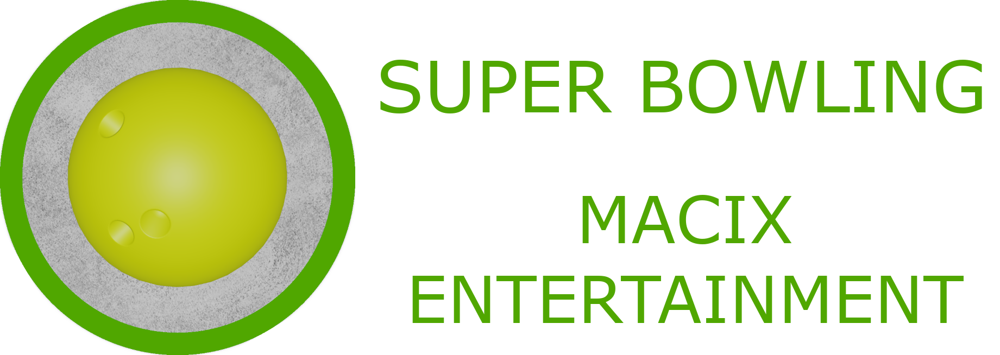
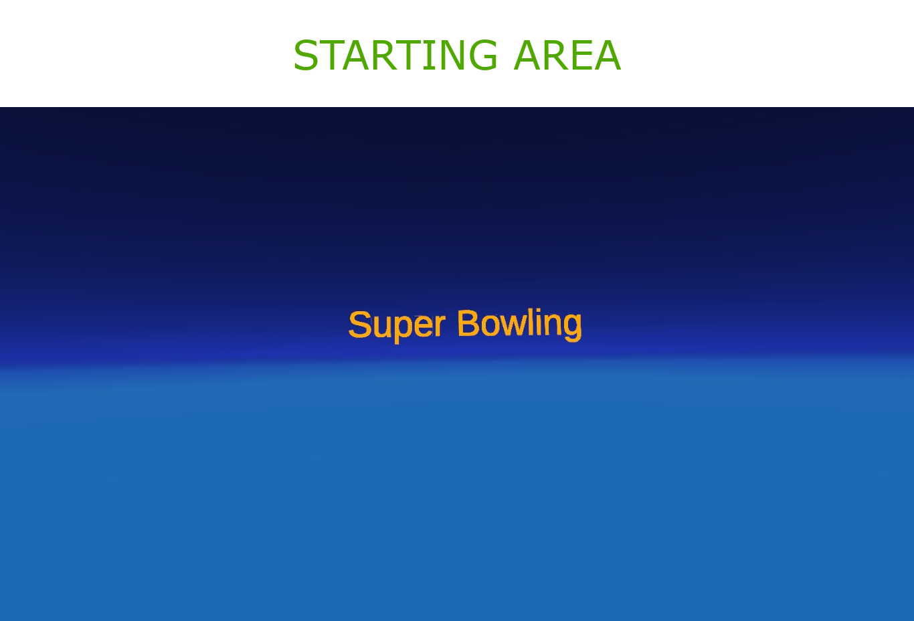
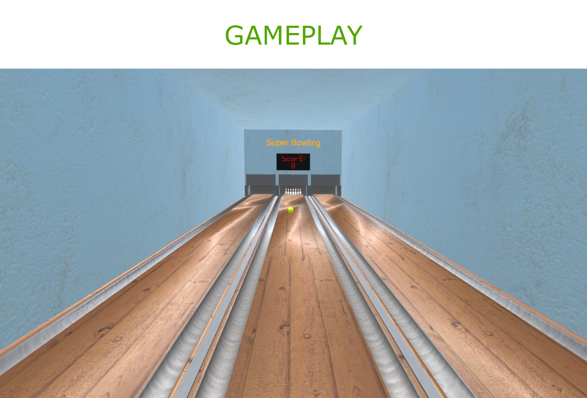
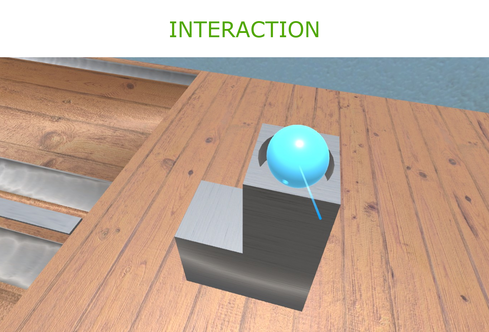

## Important links
* [Release](https://github.com/Macix97/super-bowling/releases)
* [License](https://github.com/Macix97/super-bowling/blob/main/LICENSE.txt)
* [Documentation](https://github.com/Macix97/super-bowling/tree/main/Docs/SuperBowlingV1.0.pdf)

## Abstract

Super Bowling is simple VR bowling game. The goal of the game is to knock down the pins with the ball. Each accurate hit guarantees additional points.

## Features

The list below presents most important properties:
* Smart start area with smooth transition.
* XR controller that allows throwing the ball.
* Scoreboard that displays current result.
* One small playable level.

## Game visualization

### The pictures below show the most important aspects of the program:

## Used technologies

The list of used solutions:
* Unity 2022.3.8f1 - Efficient and expanded game engine.
* Visual Studio Code 1.82.0 - Primary, lightweight IDE.
* Blender 3.2.2 - 3D computer graphics software used for creating visual effects.
* GIMP 2.10 - Open source image editor.

## Credits

The author of the project have using some arts shared by CC0 or CC BY license. Without this support, the game would not be possible. A complete list of the used materials and their creators can be found in the credits text file. Moreover, many free resources from the unity asset store were included.